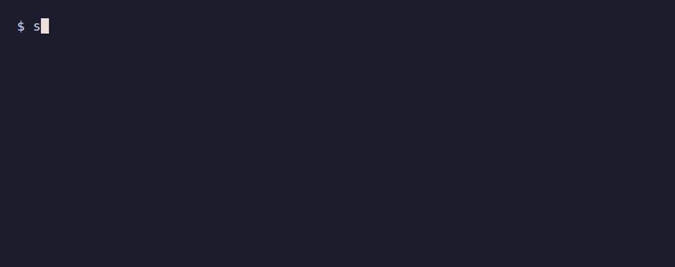

# Starred for Claude Code

[](https://github.com/artengin/claude-starred/actions/workflows/ci.yml)
[](https://github.com/artengin/claude-starred/releases/latest)

Bookmarks for your Claude Code sessions.

Star the sessions worth coming back to with `/star`, then find and reopen them from one small tree in your terminal. Starred sessions survive Claude Code's automatic cleanup.
<p align="center">
  
</p>

## Why

- **Good sessions get lost.** After a few weeks there are dozens of sessions across projects, and the one with the right context is hard to find.
- **Old sessions disappear.** Claude Code deletes sessions after 30 days by default, including the ones you meant to come back to.

`claude-starred` keeps only the sessions you chose, under names you gave them, grouped by project, for as long as you need them.

## Features

- `/star` inside any Claude Code session adds it to the list and asks for a name; `/unstar` removes it.
- One tree for all projects: project first, then its sessions. Sessions from every git worktree of a repository are shown together under that repository.
- `Enter` reopens a session right in your current terminal, in its original directory.
- Starred sessions are kept safe from Claude Code's cleanup.
- Rename and unstar without leaving the keyboard.
- Linux, macOS and Windows. English and Russian interface.

## Quick start

1. Install (Linux and macOS):

   ```sh
   curl -fsSL https://raw.githubusercontent.com/artengin/claude-starred/main/install.sh | sh
   ```

   This installs `claude-starred` into `~/.local/bin` and the `/star` and `/unstar` skills into Claude Code.

2. In a Claude Code session you want to keep, run:

   ```
   /star
   ```

   or give the name right away: `/star Checkout flow redesign`.

3. Later, in any terminal:

   ```sh
   claude-starred
   ```

**Windows:** download `claude-starred_windows_amd64.zip` from [releases](https://github.com/artengin/claude-starred/releases), put `claude-starred.exe` on your `PATH` and run `claude-starred install`.

**With Go:** `go install github.com/artengin/claude-starred/cmd/claude-starred@latest && claude-starred install`.

## Update and uninstall

```sh
claude-starred update
claude-starred uninstall
```

`update` replaces the binary and refreshes the skills. `uninstall` removes the skills, the starred list with its kept copies, and the binary. Sessions that Claude has already deleted are returned to it first; you are warned about the ones that cannot be returned, because they will be lost.

## Keys

| Key | Action |
|---|---|
| `j` / `k`, arrows | down / up |
| `l`, `Enter`, `→` | open |
| `h`, `Esc`, `←` | go back |
| `g` / `G` | first / last |
| `r` | rename |
| `d` | unstar (asks for confirmation) |
| `p` | toggle directory names / full paths |
| `?` | help |
| `q` | quit |

`●` marks a session that is running right now and ○ one that is not; the list refreshes on its own. Opening a running session asks for confirmation, because two Claude processes on one session would write to the same transcript.

## Good to know

- Claude Code deletes old sessions after `cleanupPeriodDays`. Starred sessions are kept: `claude-starred` brings them back, so `claude --resume` keeps working. Subagent history and file checkpoints of old sessions are still removed by Claude.
- The kept copy is a hard link of the transcript, so it always matches. When a hard link is impossible (the data directory is on another filesystem), `/star` warns that the copy is a snapshot; it is refreshed every time you open `claude-starred`.
- `claude-starred` never changes Claude Code's settings or transcripts. Names are stored separately, so they don't show up in Claude's `/resume`.
- The interface language follows `LANG`.
- Claude Code's session format is undocumented, so a Claude Code update may break `claude-starred`.

## License

This project is open-source software licensed under the [MIT license](LICENSE.md).
